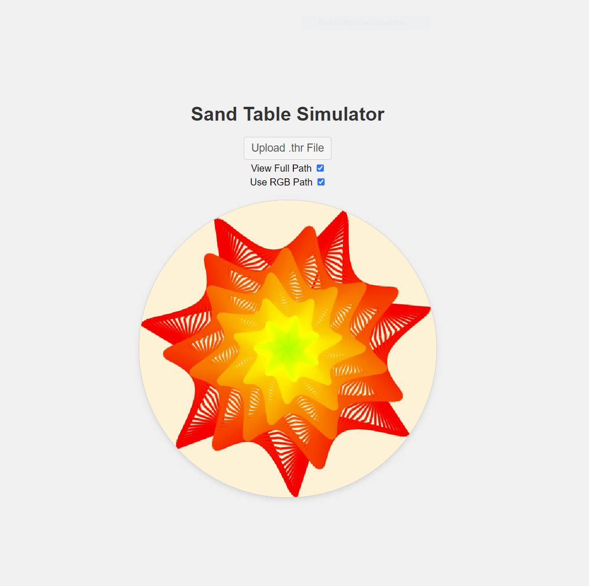

# SandTable Viewer

SandTable Viewer is a web-based application that visualizes a sand table with customizable paths and ball animations.



## Features

- Display paths read from `.thr` files in a graphical interface.
- Smooth animation of a ball following the displayed paths.
- Option to display paths using RGB colors based on polar coordinates.

## Installation

No installation required. Simply open `index.html` in a web browser to use the SandTable Simulator.

## Usage

- **Upload .thr File**: Click the "Upload .thr File" button to load a `.thr` file containing path coordinates.
- **View Full Path**: Toggle the "View Full Path" checkbox to display the entire path at once.
- **Use RGB Path**: Toggle the "Use RGB Path" checkbox to switch between RGB path coloring and a single color (beige when RGB is disabled).
- **Animation**: The ball animates along the path once loaded, adjusting speed based on configuration.

## Configuration

- **Canvas Dimensions**: The canvas maintains a 1:1 aspect ratio and is round for a consistent drawing experience.
- **Ball Speed**: Adjust the `ballSpeed` variable in `script.js` to control the speed of the ball.
- **Colors**: Customize colors and appearance in `styles.css` and `script.js` for a personalized simulation experience.

## File Structure

```
sandtable-website/
│
├── index.html        # Main HTML file for SandTable Simulator
├── script.js         # JavaScript for animation and interaction
└── styles.css        # CSS for styling the SandTable Simulator interface
```